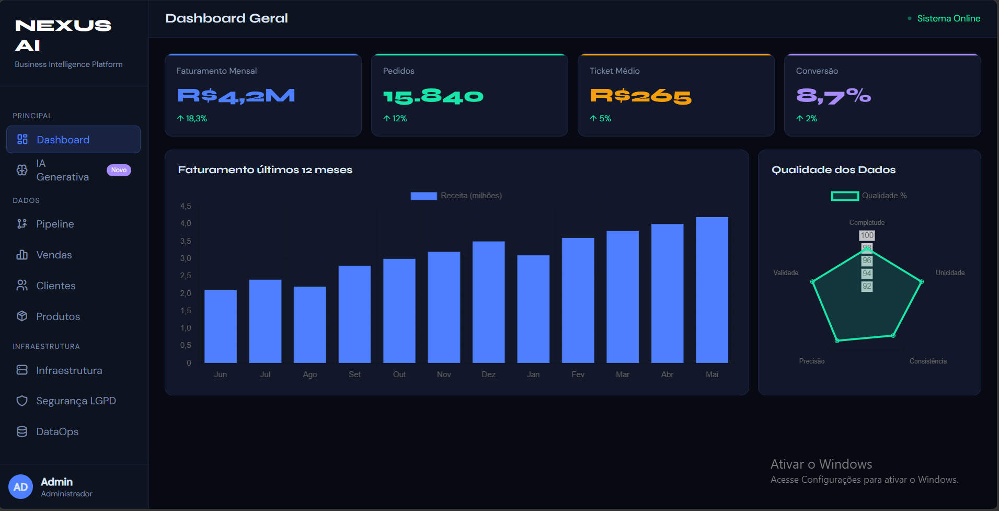

# 🚀 NEXUS AI - Business Intelligence Platform

## Projeto Integrador — ExpoTech 2026

Sistema de análise de dados desenvolvido para demonstrar uma plataforma de Business Intelligence com arquitetura de dados, processamento, qualidade e visualização.

---

# 👥 Integrantes

- Enzo Gabriel Arruda Da Silva — 151043
- Danilo Rocha Garcia Ferreira — 151927
- Julio César Ferreira Passos — 149473
- Gustavo Maciel Brito de Matos — 158819
- Henrique Sanchez Guimarães Rosa — 147679

## Instituição

Unifecaf

## Curso

GTI - Gestão da Tecnologia da Informação

---

# 🎯 Objetivo do Projeto

O NEXUS AI tem como objetivo apresentar uma plataforma inteligente para análise de dados empresariais, permitindo acompanhar indicadores de vendas, clientes, produtos e qualidade dos dados.

A solução busca transformar dados brutos em informações estratégicas para apoiar decisões de negócio.

---

# 🏗️ Arquitetura da Solução

O projeto utiliza uma arquitetura de dados composta por:

- Camada de coleta de dados
- Processamento e transformação
- Armazenamento analítico
- Dashboard para visualização
- Inteligência Artificial para consultas em linguagem natural

Fluxo dos dados:
Origem dos dados
↓
Ingestão
↓
Processamento
↓
Banco de dados
↓
Dashboard / IA

---

# 🗄️ Tecnologias Utilizadas

## Front-end

- HTML5
- CSS3
- JavaScript
- Chart.js
- Tabler Icons

## Dados

- SQL
- Data Warehouse
- Processamento analítico

## Conceitos aplicados

- ETL / ELT
- Pipeline de dados
- Data Quality
- DataOps
- LGPD
- Monitoramento

---

# 📊 Funcionalidades

## Dashboard

Visualização de:

- Faturamento
- Pedidos
- Conversão
- Indicadores de desempenho

## IA Generativa

Consulta de dados utilizando linguagem natural.

Exemplos:

- "Qual o faturamento dos últimos meses?"
- "Quais clientes possuem risco de churn?"

---

# 🔄 Pipeline de Dados

O fluxo utilizado:

### 1. Origem

Dados de vendas, clientes e produtos.

### 2. Processamento

Limpeza, organização e transformação dos dados.

### 3. Armazenamento

Dados preparados para consultas analíticas.

### 4. Consumo

Dashboards e análises gerenciais.

---

# 🔐 Segurança e Qualidade

Foram considerados:

- Controle de acesso
- Proteção de dados
- Validação de informações
- Tratamento de dados duplicados
- Boas práticas de governança

---

# 📈 Resultados Esperados

A plataforma permite:

- Melhor tomada de decisão
- Visualização rápida dos indicadores
- Identificação de padrões de negócio
- Análise preditiva de clientes

---

# 📷 Dashboard

---

# 🌐 Aplicação Online

https://nexus-horned-data-flow.base44.app
